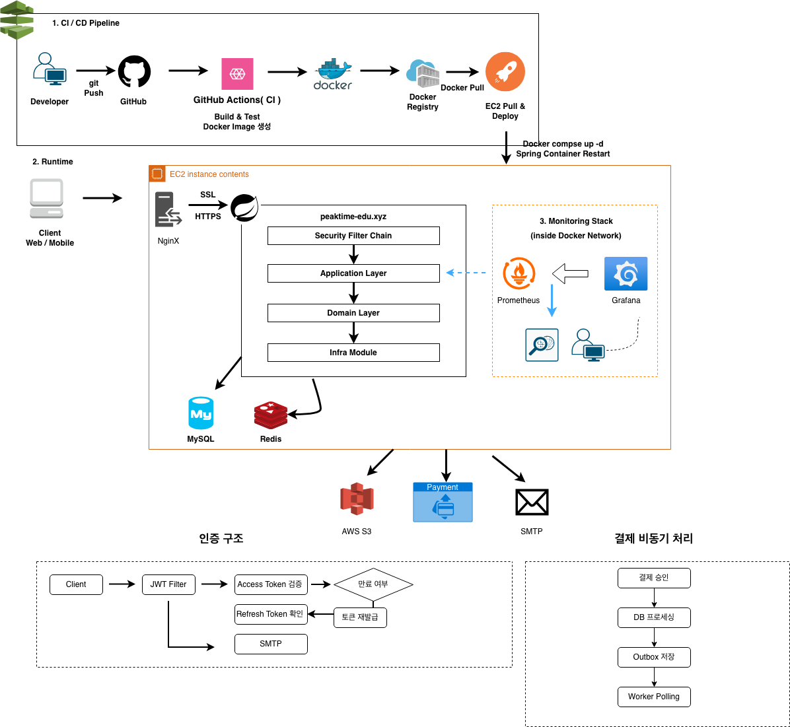

# Peak-Time

Peak-Time은 학습자와 지식 공유자를 연결하는 교육 기반 커피챗 매칭 플랫폼 백엔드입니다.  
강의 탐색부터 주문/결제, 수강, 실시간 커피챗까지 하나의 학습 흐름으로 연결합니다.

Repository: [Sleep-Less-Specialist/Peak-Time](https://github.com/Sleep-Less-Specialist/Peak-Time)

## 프로젝트 목표
- 상호작용 중심 학습 경험 제공
- 강의 구매 이후 1:1 커피챗까지의 학습 여정 통합
- 역할 기반 운영 정책(`STUDENT`, `LECTURER`, `ADMIN`)

## 아키텍처


## 핵심 기능
1. 인증/인가  
   JWT Access/Refresh, Redis 화이트리스트, Rotation/재사용 탐지, OAuth2(Google/Kakao), 로그인 시도 제한
2. 사용자  
   회원가입/로그인/로그아웃/재발급, 온보딩, 비밀번호 재설정 메일, 프로필(S3), 내 정보/내 강의
3. 강의/수강/리뷰  
   강의 등록/수정, 목록/상세, 영상 업로드/재생 URL, 결제 연동 수강 생성/취소, 리뷰 CRUD
4. 주문/결제/환불  
   주문 생성/조회, 포인트 차감/환급, Toss 승인/취소, 환불 상태 반영
5. 커피챗  
   채팅방 생성/참여/종료, STOMP 실시간 메시지, 읽음 처리, Cursor 기반 페이징
6. 관리자  
   사용자 목록/상태 변경, 역할 기반 접근 제한

## 기술 스택
- **Java 17**: LTS 기반으로 안정적인 백엔드 런타임 사용
- **Spring Boot 3.5.9**: API/비즈니스 로직 중심의 애플리케이션 프레임워크
- **Spring Security + JWT + OAuth2 Client**: 토큰 기반 인증과 소셜 로그인 처리
- **Spring Data JPA + MySQL**: 도메인 중심 데이터 모델링 및 영속성 관리
- **Redis**: Refresh Token 저장, 로그인 시도 제한, 임시 데이터 캐시
- **WebSocket(STOMP, SockJS)**: 커피챗 실시간 메시징 처리
- **AWS S3**: 프로필/강의 파일 업로드 및 저장
- **Toss Payments**: 결제 승인/취소 연동
- **Prometheus + Grafana**: 애플리케이션 메트릭 수집 및 대시보드 모니터링
- **ELK(Filebeat, Elasticsearch, Kibana)**: 구조화 로그 수집/검색/분석
- **Docker / Docker Compose**: 로컬/운영 환경의 실행 일관성 확보
- **GitHub Actions**: CI/CD 자동화 파이프라인 운영
- **Spring REST Docs + Asciidoctor**: 테스트 기반 API 문서 자동 생성

### 테스트 및 문서화
- **단위 테스트(Unit Test)**: 주요 도메인 서비스/컨트롤러 중심으로 작성 및 유지
- **통합 테스트(Integration Test)**: Testcontainers 기반 DB/Redis 연동 시나리오 확장 예정
- **Spring REST Docs + Asciidoctor**: 테스트 기반 API 문서 자동화 도입 예정

## 실행 방법

### 1) 사전 준비
- Java 17
- Docker / Docker Compose

### 2) 환경 변수
- `DB_URL`, `DB_USERNAME`, `DB_PASSWORD`, `DB_DDL_AUTO`
- `SPRING_REDIS_HOST`, `SPRING_REDIS_PORT`
- `JWT_SECRET_KEY`
- `KAKAO_CLIENT_ID`, `KAKAO_CLIENT_SECRET`
- `GOOGLE_CLIENT_ID`, `GOOGLE_CLIENT_SECRET`
- `TOSS_CLIENT_KEY`, `TOSS_SECRET_KEY`
- `AWS_S3_BUCKET`, `AWS_ACCESS_KEY`, `AWS_SECRET_KEY`
- `GMAIL_ID`, `SMTP_PASSWORD`
- `BASE_URL`

### 3) 로컬 인프라 실행
```bash
docker compose up -d
```

### 4) 앱 실행
```bash
./gradlew bootRun
```

## 모니터링 / 로깅
### Prometheus + Grafana
```bash
cd monitoring
docker compose -f docker-compose.monitoring.yml up -d
```
### ELK (Elasticsearch + Kibana + Filebeat)
```bash
cd logging
docker compose -f docker-compose.elk.yml up -d
```

## API 테스트
`http/` 폴더 시나리오 파일:

- `auth.http`
- `member.http`
- `course.http`
- `lecturer-courses.http`
- `order.http`
- `payment.http`
- `chat.http`
- `message.http`
- `review.http`
- `admin.http`

## 문서
- 컨벤션: `docs/convention/code-convention.md`, `docs/convention/ground-rules.md`
- 인프라: `docs/infra/nginx-https.md`
- REST Docs: 현재 미적용, 적용 후 `./gradlew test asciidoctor` 기반 문서 경로 안내 예정
