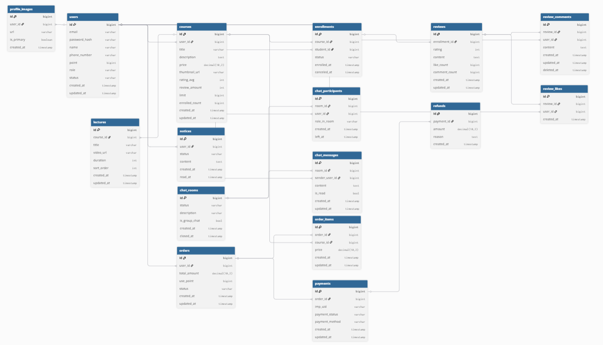
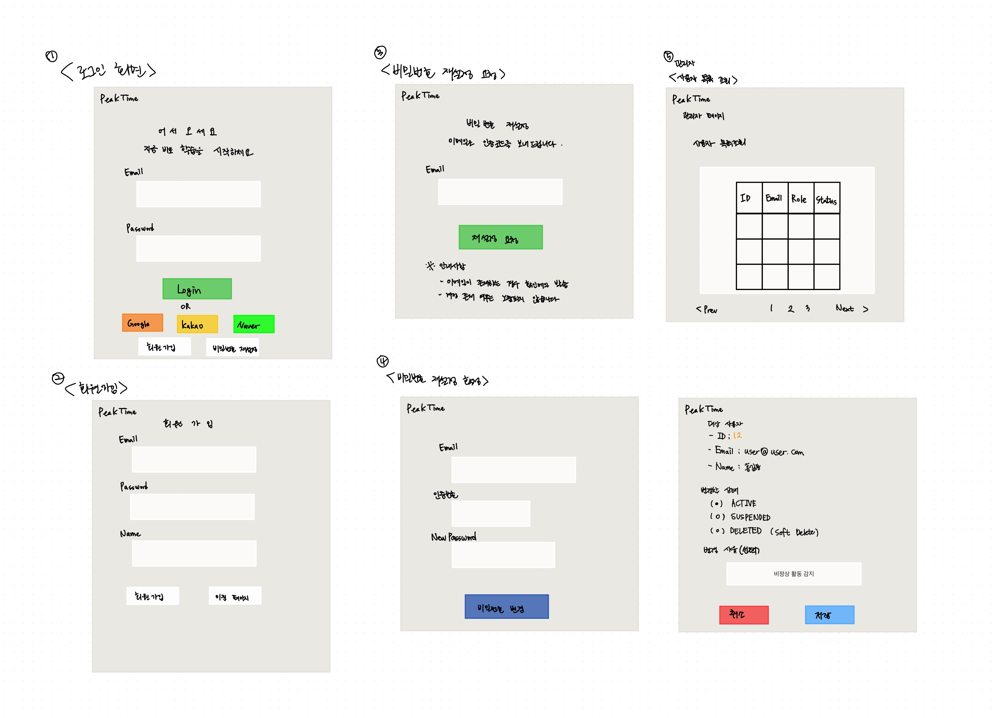
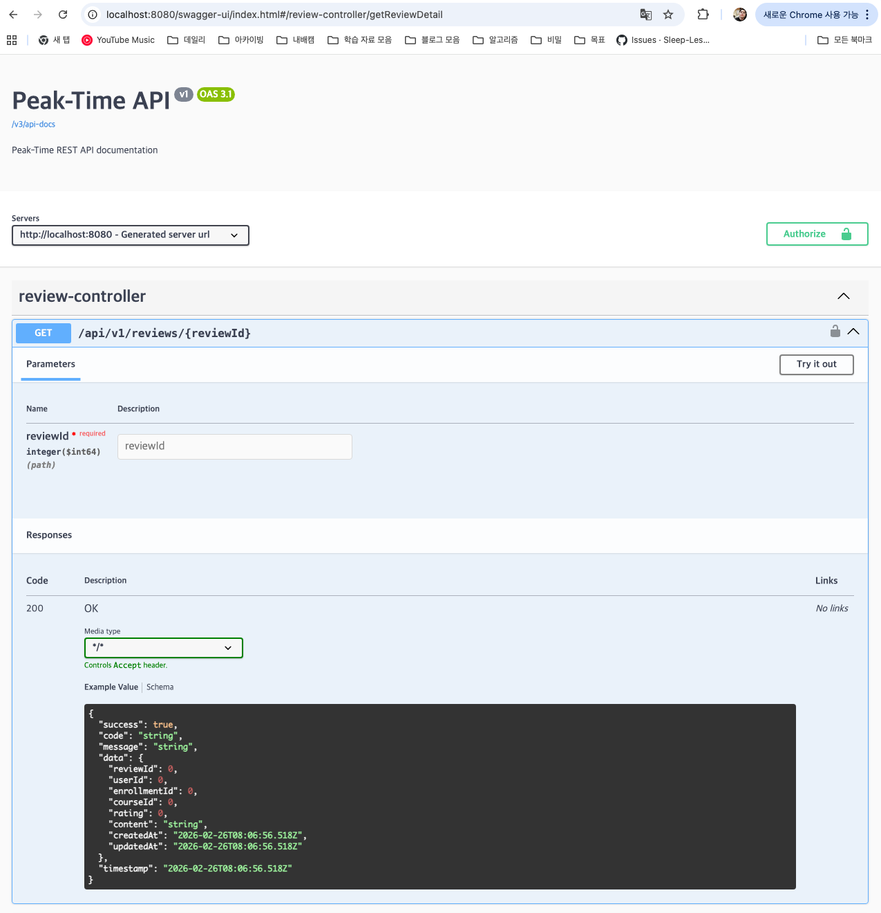

# Peak-Time

Peak-Time은 학습자와 지식 공유자를 연결하는 교육 기반 커피챗 매칭 플랫폼 백엔드입니다.  
강의 탐색부터 주문/결제, 수강, 실시간 커피챗까지 하나의 학습 흐름으로 연결합니다.

Repository: [Sleep-Less-Specialist/Peak-Time](https://github.com/Sleep-Less-Specialist/Peak-Time)

## 프로젝트 목표
- 상호작용 중심 학습 경험 제공
- 강의 구매 이후 1:1 커피챗까지의 학습 여정 통합
- 역할 기반 운영 정책(`STUDENT`, `LECTURER`, `ADMIN`)

## 개발 중점
- **유지보수하기 쉬운 구조 우선**: 기능 추가 속도보다 책임 분리와 공통화에 집중해 장기적으로 관리 가능한 코드를 지향
- **프론트 협업을 고려한 API 설계**: 서버사이드 렌더링보다 API 중심 구조를 채택하고, JSON 응답 형식을 일관되게 유지
- **변경에 강한 설계**: 구현체에 직접 묶이지 않도록 의존성을 분리해 기능 확장 시 기존 코드 수정 범위를 최소화
- **공통 로직 분리로 중복 최소화**: 로깅/예외 처리/보안 같은 반복 로직은 공통 계층으로 분리해 핵심 비즈니스 로직에 집중
- **운영 안정성 중심 기술 선택**: 라이브러리나 기능 도입 시 목적과 대안을 비교하고, 실제 운영 안정성에 기여하는지 기준으로 판단
- **예외/응답 정책 표준화**: 예외 유형과 HTTP 상태 코드를 통일해 클라이언트와의 계약을 명확화
- **트래픽 증가 상황 대비**: 인증/로그인 처리와 동시성 이슈를 고려해 확장 가능한 구조를 우선적으로 적용


## 협업 방식
- **Branch 전략 기반 병렬 개발**: 기능/개선/수정 단위 브랜치 분리로 충돌 최소화
- **PR 중심 코드 리뷰 프로세스**: 모든 변경을 PR로 통합하고 설계 의도/영향 범위/품질 기준 상호 검증
- **GitHub Issue 기반 작업 정의**: 기능/버그/리팩터링/테스트 작업을 이슈로 명세하고 완료 기준 추적
- **칸반보드 기반 일정/상태 관리**: `Backlog / Ready / hotfix(긴급처리 시) / In progress / In review / Done` 흐름으로 우선순위와 병목 관리
- **코드 컨벤션 준수**: 네이밍/계층 책임/예외 처리/응답 포맷 기준 통일
  - 기본 코드 컨벤션은 Naver Code Convention 을 기준으로 진행 
- **Git 컨벤션 준수**: 브랜치/커밋/PR 템플릿/리뷰 체크리스트 일관 적용

> 협업 관련 캡처(브랜치 전략, PR 템플릿, 이슈 템플릿, 칸반보드)는 Wiki에 상세 정리

## 아키텍처


## ERD


## 와이어프레임


> 상세 화면/ 흐름은 Wiki에서 관리

## Swagger 운영현황

### Swagger 접속 경로
- Local: [http://localhost:8080/swagger-ui/index.html](http://localhost:8080/swagger-ui/index.html)
- OpenAPI JSON: [http://localhost:8080/v3/api-docs](http://localhost:8080/v3/api-docs)


## 핵심 기능
1. 인증/인가  
   JWT Access/Refresh, Redis 화이트리스트, Rotation/재사용 탐지, OAuth2(Google/Kakao), 로그인 시도 제한
2. 사용자  
   회원가입/로그인/로그아웃/재발급, 온보딩, 비밀번호 재설정 메일, 프로필(S3), 내 정보/내 강의
3. 강의/수강/리뷰  
   강의 등록/수정, 목록/상세, 영상 업로드/재생 URL, 결제 연동 수강 생성/취소, 리뷰 CRUD
4. 주문/결제/환불  
   주문 생성/조회, 포인트 차감/환급, Toss 승인/취소, 환불 상태 반영
5. 커피챗  
   채팅방 생성/참여/종료, STOMP 실시간 메시지, 읽음 처리, Cursor 기반 페이징
6. 관리자  
   사용자 목록/상태 변경, 역할 기반 접근 제한

## 기술 스택
| 구분 | 기술 | 사용 목적 |
|---|---|---|
| Language | Java 17 | LTS 기반 안정적 런타임 |
| Framework | Spring Boot 3.5.9 | API/비즈니스 로직 개발 |
| Security | Spring Security, JWT, OAuth2 Client | 인증/인가 및 소셜 로그인 |
| Data | Spring Data JPA, MySQL | 도메인 데이터 영속성 |
| Cache | Redis | Refresh Token 저장, 로그인 시도 제한 |
| Realtime | WebSocket, STOMP, SockJS | 실시간 커피챗 메시징 |
| Storage | AWS S3 | 프로필/강의 파일 저장 |
| Payment | Toss Payments | 결제 승인/취소 연동 |
| Observability | Prometheus, Grafana, ELK | 메트릭/로그 관측 |
| Infra | Docker, Docker Compose | 실행 환경 일관성 |
| CI/CD | GitHub Actions | 빌드/배포 자동화 |
| Docs | Swagger(OpenAPI), Spring REST Docs, Asciidoctor | 현재 Swagger 운영, REST Docs 기반 자동화 전환 예정 |

### 테스트 및 문서화
- **단위 테스트(Unit Test)**: 주요 도메인 서비스/컨트롤러 중심으로 작성 및 유지
- **통합 테스트(Integration Test)**: Testcontainers 기반 DB/Redis 연동 시나리오 확장 예정
- **Spring REST Docs + Asciidoctor**: 테스트 기반 API 문서 자동화 도입 예정

## 실행 방법

### 1) 사전 준비
- Java 17
- Docker / Docker Compose

### 2) 환경 변수
- `DB_URL`, `DB_USERNAME`, `DB_PASSWORD`, `DB_DDL_AUTO`
- `SPRING_REDIS_HOST`, `SPRING_REDIS_PORT`
- `JWT_SECRET_KEY`
- `KAKAO_CLIENT_ID`, `KAKAO_CLIENT_SECRET`
- `GOOGLE_CLIENT_ID`, `GOOGLE_CLIENT_SECRET`
- `TOSS_CLIENT_KEY`, `TOSS_SECRET_KEY`
- `AWS_S3_BUCKET`, `AWS_ACCESS_KEY`, `AWS_SECRET_KEY`
- `GMAIL_ID`, `SMTP_PASSWORD`
- `BASE_URL`

### 3) 로컬 인프라 실행
```bash
docker compose up -d
```

### 4) 앱 실행
```bash
./gradlew bootRun
```

## 모니터링 / 로깅
### Prometheus + Grafana
```bash
docker compose -f monitoring/docker-compose.monitoring.yml up -d
```
### ELK (Elasticsearch + Kibana + Filebeat)
```bash
docker compose -f logging/docker-compose.elk.yml up -d
```
> monitoring/logging compose는 peak-time_default 외부 네트워크를 사용하므로,
> 먼저 프로젝트 루트에서 docker compose up -d를 실행해 기본 네트워크를 생성하세요.

## API 테스트
`http/` 폴더 시나리오 파일:

- `auth.http`
- `member.http`
- `course.http`
- `lecturer-courses.http`
- `order.http`
- `payment.http`
- `chat.http`
- `message.http`
- `review.http`
- `admin.http`

## 문서
- 컨벤션: `docs/convention/code-convention.md`, `docs/convention/ground-rules.md`
- 인프라: `docs/infra/nginx-https.md`
- REST Docs: 현재 미적용, 적용 후 `./gradlew test asciidoctor` 기반 문서 경로 안내 예정
